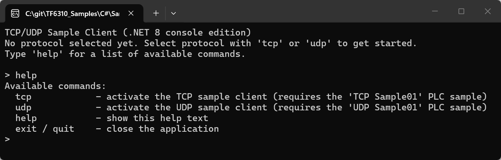
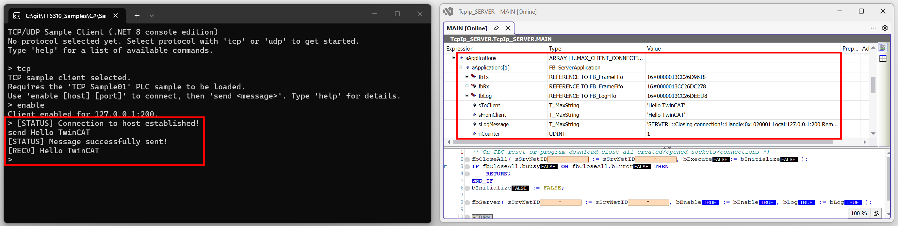
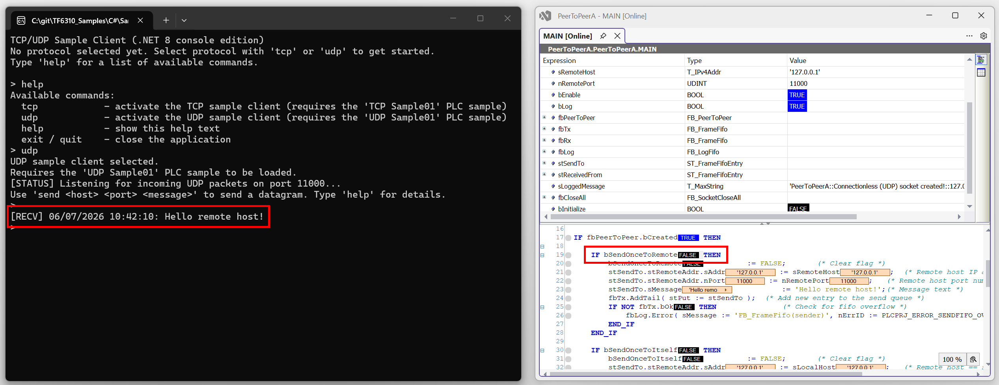

# TF6310 C# TCP/UDP Sample Client

## Overview
This sample provides a .NET 10 console application that interacts with the PLC samples `TCP Sample01` and `UDP Sample01`. The application connects to a TCP or UDP server, sends a message, and prints the received response, and all interaction happens through a single command line interpreter.

The application starts with no protocol active. Enter the desired protocol (`tcp` or `udp`) in the interpreter to activate the TCP or UDP sample client. Each protocol requires a different TF6310 PLC sample project to be loaded:

| Command | Required PLC sample |
| --- | --- |
| `tcp` | `TCP Sample01` |
| `udp` | `UDP Sample01` |

You can switch between protocols at any time by issuing the command `tcp`/`udp` again — the previously active client is cleanly disconnected/stopped before the newly selected one is activated.

## Contents
| Item | Description |
| --- | --- |
| `TcTcpIpSampleClient.slnx` | Visual Studio solution for the sample client. |
| `TcTcpIpSampleClient` | C# project that implements the console TCP/UDP client. |
| `TcTcpIpSampleClient\TcpIpClient.cs` | TCP connect/send/receive/disconnect logic, ported from the original `SampleClient\Form1.cs`. |
| `TcTcpIpSampleClient\UdpIpClient.cs` | UDP send/listen logic, ported from the original `SampleClientUdp\Form1.cs`. |
| `TcTcpIpSampleClient\Program.cs` | Command line interpreter that lets the user select and drive the TCP or UDP client. |

## Prerequisites
- .NET 10 SDK — download and install from https://dotnet.microsoft.com/download/dotnet/10.0
- Visual Studio 2022 version 17.13 or later (required to open the `.slnx` solution file); alternatively, use the `dotnet` CLI directly
- TF6310 TC3 TCP/IP installed on the target device
- The matching TF6310 PLC sample loaded and running (`TCP Sample01` for the TCP client, `UDP Sample01` for the UDP client)

## Quick start
1. Build the project: `dotnet build` (from the `SampleClient` folder).
2. Run the console app: `dotnet run --project TcTcpIpSampleClient`.
3. Select a protocol with `tcp` or `udp`.
4. Type `help` to see the generic commands plus the commands available for the currently selected protocol.
5. Use `exit`/`quit` to leave the application (this also disconnects/stops the active client).

## Generic commands
| Command | Description |
| --- | --- |
| `tcp` | Activates the TCP sample client. Requires the `TCP Sample01` PLC sample to be loaded. |
| `udp` | Activates the UDP sample client. Requires the `UDP Sample01` PLC sample to be loaded. |
| `help` | Prints the generic commands, plus the commands for the currently selected protocol (if any). |
| `exit` / `quit` | Disconnects/stops the active client (if any) and closes the application. |

## TCP commands (after `tcp` command)
| Command | Description |
| --- | --- |
| `enable [host] [port]` | Parses the host/port (defaults to `127.0.0.1`/`200`), and starts a background task that connects and keeps retrying while not connected. |
| `disable` | Disconnects from the host and stops the background reconnect loop. |
| `send <message>` | Sends an ASCII payload terminated by `0x00` and prints the server's response. |
| `status` | Prints whether the client is enabled/connected and to which host/port. |

Detailed data exchange behavior:

- The target endpoint is parsed from the `enable` command arguments into an `IPEndPoint`, and connected via a `Socket` inside `TcpIpClient`.
- Outgoing payload text is passed as the argument to the `send` command, converted to bytes, and sent with `Socket.Send(...)`.
- Incoming response bytes are received into a receive buffer, decoded to a string, and printed to the console prefixed with `[RECV]`.
- Connection and transfer state messages are printed to the console prefixed with `[STATUS]`.

## UDP commands (after `udp` command)
| Command | Description |
| --- | --- |
| `send <host> <port> <message>` | Sends a UDP datagram to the given host/port using source port `11001`. Please note that the PLC sample `UDP Sample01` uses port 10000 to listen for incoming messages. |
| `status` | Prints that the listener is active and how to send a datagram. |

A background listener is started automatically as soon as `udp` is executed, listening on local port `11000`. This port is also used by PLC sample `UDP Sample01` when sending datagram by triggering the PLC variable `MAIN.bSendOnceToRemote`. Any incoming datagram is printed to the console, prefixed with a timestamp and `[RECV]`, as soon as it arrives — no command needs to be issued to receive data. The listener is stopped automatically when switching to `tcp` or on `exit`/`quit`.

Detailed data exchange behavior:

- The destination endpoint is parsed from the `send` command arguments into an `IPEndPoint`, used to connect a short-lived `UdpClient` bound to source port `11000`, and the message is sent as ASCII bytes.
- A background task (`UdpIpClient.ListenLoop`) continuously listens on local port `1002` for incoming datagrams.
- Received datagrams are decoded as ASCII and printed to the console prefixed with `[RECV]` and a timestamp.

## Support
Should you have any questions regarding this sample, please contact your local Beckhoff support team. Contact information can be found on the official Beckhoff website at https://www.beckhoff.com/contact/.
