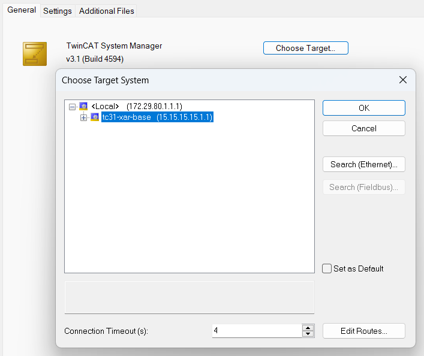

# About this Repository

This repository provides a step-by-step guide to build and deploy a containerized TwinCAT 3.1 XAR runtime environment that also includes the TwinCAT TCP/IP Function using Docker on a Beckhoff IPC.

With this sample, you will learn how to:

- Build and configure a TwinCAT XAR container image that also includes the TwinCAT TCP/IP Function.
- Set up secure communication between Engineering and Runtime using ADS-over-MQTT.
- Manage containers with Docker Compose and Makefile automation.
- Connect to the containerized TwinCAT runtime with TwinCAT Engineering.
- Run the TwinCAT TCP/IP GettingStarted sample.

Here’s a high-level overview of what the completed setup will look like:


## How to get support

Should you have any questions regarding the provided sample code, please contact your local Beckhoff support team. Contact information can be found on the official Beckhoff website at https://www.beckhoff.com/contact/.

## Using the sample

Before you begin, make sure your environment meets the following prerequisites:

- [Setup and Install](https://infosys.beckhoff.com/english.php?content=../content/1033/beckhoff_rt_linux/17350447499.html) the Beckhoff Real-Time Linux® Distribution on a supported IPC.
- [Configure access to Beckhoff package server](https://infosys.beckhoff.com/english.php?content=../content/1033/beckhoff_rt_linux/17350408843.html)
- Install [Docker Engine on Debian](https://docs.docker.com/engine/install/debian/#install-using-the-repository)
- Run the following command to install the TwinCAT System Configuration tools and make on the host: `sudo apt install --yes make tcsysconf`

Once the prerequisites are in place, you can follow these steps to build and deploy the container.

1. **Build the container image**

During the image build process, TwinCAT for Linux® will be downloaded from `https://deb.beckhoff.com`. To access the package server replace `<mybeckhoff-mail>` and `<mybeckhoff-password>` in `./tc31-opc-ua-server/apt-config/bhf.conf` with valid myBeckhoff credentials.

Furthermore, ensure that the file `./tc31-tcp-ip/apt-config/bhf.list` contains the correct Debian distribution codename of the current suite (e.g. `trixie-unstable` for beta versions).

Afterwards navigate to the `tc31-tcp-ip` directory and run:

```bash
sudo docker build --secret id=apt,src=./apt-config/bhf.conf --network host -t tc31-tcp-ip .
```

Alternatively the included `Makefile` can be used as wrapper for the most frequently used `docker` commands:

```bash
sudo make build-image
```

2. **Set up firewall rules**

The sample will make use of **ADS-over-MQTT** for the communication between the TwinCAT XAR containers and the TwinCAT Engineering. In addition and for demonstration purposes, we will also open the TCP port that is used by the GettingStarted sample, although the sample only communicates via the localhost (127.0.0.1) adapter.

To establish an ADS-over-MQTT connection between Engineering and Runtime, you need to allow incoming connections to the MQTT port. This requires to configure the firewall of the host system. Beckhoff Real-Time Linux® uses nftables as its default firewall framework. To set up an nftables rule for the message broker, please create a corresponding configuration file that represents this rule:

```
sudo nano /etc/nftables.conf.d/60-mosquitto-container.conf
```

Then copy the following code snippet into that file:

```nft
table inet filter {
  chain input {
    tcp dport 1883 accept
  }
  chain forward {
    type filter hook forward priority 0; policy drop;
    tcp sport 1883 accept
    tcp dport 1883 accept
  }
}
```

Save the file by pressing <kbd>Ctrl</kbd>+<kbd>o</kbd> and <kbd>Enter</kbd>.
Then close the editor via <kbd>Ctrl</kbd>+<kbd>x</kbd> and <kbd>Enter</kbd>.

To allow incoming connections to the TCP server port that is used by the GettingStarted sample, create another firewall rule as follows:

```
sudo nano /etc/nftables.conf.d/70-tctcpip-container.conf
```

Then copy the following code snippet into that file:

```nft
table inet filter {
  chain input {
    tcp dport 12000 accept
  }
  chain forward {
    type filter hook forward priority 0; policy drop;
    tcp sport 12000 accept
    tcp dport 12000 accept
  }
}
```

Save the file by pressing <kbd>Ctrl</kbd>+<kbd>o</kbd> and <kbd>Enter</kbd>.
Then close the editor via <kbd>Ctrl</kbd>+<kbd>x</kbd> and <kbd>Enter</kbd>.

Apply the rules with the following command:

```bash
sudo nft -f /etc/nftables.conf.d/60-mosquitto-container.conf
sudo nft -f /etc/nftables.conf.d/70-tctcpip-container.conf
```

3. **Start the containers**

The sample includes a Docker Compose file (`docker-compose.yml`) to simplify the process of creating containers and their configuration, including network settings and volumes as well as any additional parameters like port mappings or environmental variables. Using the Docker Compose file, you can specify which "services" should be set up. Services are named definitions of a container (or a group of containers) and define how they should be run. In this sample, we want to start the following services:

- A container instance of the Mosquitto Message Broker
- A container instance of our custom `tc31-tcp-ip` image

**Make sure that the network settings do not conflict with any existing containers or networks defined on your host.** This might be the case if you have tried other samples before and if the corresponding containers are still running. If this is the case, adapt the Docker Compose file accordingly, for example by using different IP addresses (ipv4_address) for the containers or also by removing not required containers from the Docker Compose file (for example if you already have a container for the Mosquitto message broker). Also make sure that each runtime container has a unique AMS Net ID by configuring the corresponding environment variable (AMS_NETID).

You can use the following command to setup the containers:

```bash
sudo docker compose up -d
```

You can verify that all containers have been started successfully by executing the following command:

```bash
sudo docker ps
```

You should see two running container instances (`mosquitto` and `tc31-tcp-ip`). You can also reduce the default output of this command to only include relevant information, for example:

```bash
sudo docker ps --format "table {{.Names}}\t{{.Status}}\t{{.Image}}\t{{.Ports}}"
```

4. **Configure ADS-over-MQTT connections**

To connect your TwinCAT Engineering system via ADS-over-MQTT with the containerized TwinCAT runtime, please use the `mqtt.xml` template file, which represents an ADS-over-MQTT configuration file. In this file, please replace the placeholder `ip-address-of-container-host` with the actual **IP address of the Docker host**.
Copy the adjusted file to the following directory on your TwinCAT Engineering system:

```
C:\Program Files (x86)\Beckhoff\TwinCAT\3.1\Target\Routes\
```

Afterwards, restart (a "re-config" is sufficient) the TwinCAT System Service via the system tray context menu.
The containerized TwinCAT runtime should now appear as an available target system in TwinCAT Engineering.



5. **Run the GettingStarted sample**

You can find the GettingStarted sample in the folder `PLC/GettingStarted` of this repository. Simply open the sample using your TwinCAT XAE Engineering environment and activate the sample on the container target. The container target will, thanks to our ADS-over-MQTT route, be shown in the target device list. The sample establishes a TCP client/server communication using the TCP server port 12000. The client application sends a message to the server and the server bounces this message back to the client.

